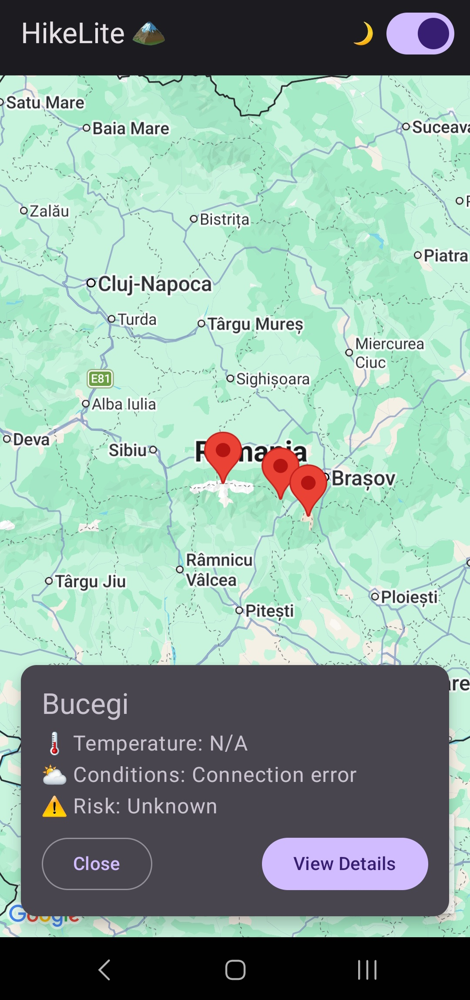

# HikeLite 🏔

A lightweight Android hiking companion app built with **Jetpack Compose** and **Google Maps**. Browse mountain trails across Romania, check live weather conditions, and leave personal notes for each trail — all from a clean, dark-mode-ready interface.

---

## Screenshots

### Map Screen — Selected Mountain
<!-- Add your screenshot here -->
> _Drop a screenshot of the map with a selected mountain range card here._



---

## Features

- 🗺 **Interactive Map** — Google Maps integration with markers for each mountain trail
- ⛅ **Live Weather** — Tap a marker to fetch real-time weather, conditions, and risk level for that mountain
- 📝 **Trail Notes** — Add, view, and delete personal notes per trail, persisted locally with Room
- 🌙 **Dark Mode** — Toggle dark/light theme in real time from the top bar
- 📋 **Trail Details** — Dedicated screen with difficulty rating, description, weather summary, and notes

---

## Tech Stack

| Layer | Technology |
|---|---|
| UI | Jetpack Compose + Material 3 |
| Maps | Google Maps Compose (`maps-compose`) |
| Navigation | Compose Navigation |
| ViewModel | AndroidViewModel + StateFlow |
| Local DB | Room 2.7 + KSP |
| Networking | Retrofit 2 + Gson |
| Language | Kotlin 2.3.21 |
| Min SDK | 24 (Android 7.0) |
| Target SDK | 36 |

---

## Project Structure

```
app/src/main/java/com/vapuss/hikelite/
├── data/
│   ├── local/          # Room database, DAO
│   ├── model/          # Data classes (Trail, NoteEntity, WeatherResponse)
│   ├── remote/         # Retrofit client & API service
│   └── repository/     # MountainRepository
├── ui/
│   ├── navigation/     # NavGraph
│   ├── screens/        # MountainMapScreen, TrailDetailsScreen
│   └── theme/          # Material 3 theme, colors, typography
└── viewmodel/          # MountainViewModel
```

---

## Getting Started

### Prerequisites
- Android Studio Hedgehog or newer
- A Google Maps API key ([get one here](https://console.cloud.google.com/))

### Setup

1. **Clone the repo**
   ```bash
   git clone https://github.com/YOUR_USERNAME/HikeLite.git
   cd HikeLite
   ```

2. **Add your Maps API key**

   Create a `secrets.properties` file in the project root (next to `build.gradle.kts`):
   ```
   MAPS_API_KEY=your_api_key_here
   ```

3. **Set up the weather backend**

   The app fetches weather from a local REST API running at `http://10.0.2.2:5000/weather?mountain=<name>`.
   Make sure your backend server is running on your machine before launching the app in the emulator.

4. **Build & run**

   Open the project in Android Studio and hit **Run**, or:
   ```bash
   ./gradlew assembleDebug
   ```

---

## Trails Included

| Trail | Difficulty | Highlight |
|---|---|---|
| Bucegi | Medium | Vast plateau, cable car access from Sinaia |
| Fagaras | Hard | Highest massif in Romania — Moldoveanu Peak (2544m) |
| Piatra Craiului | Hard | Spectacular limestone ridge |

---

## License

This project is for educational purposes. Feel free to fork and expand it.
